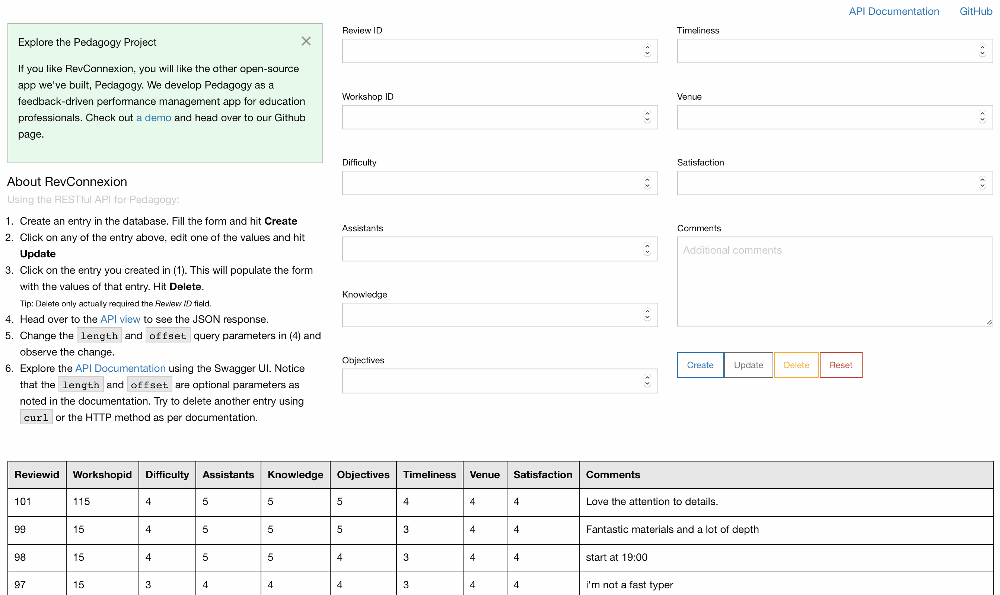

# RevConnexion

## Project Description
RevConnextion is a RESTful API application built on top of [Connexion](connexion.readthedocs.io/en/latest/) and can be used as a standalone post-workshop survey system. It is part of the Pedagogy Framework, which at this point consist of:
- [PedagogyApp](https://github.com/onlyphantom/pedagogy): A feedback-driven performance management app ([Demo](http://pedagogyapp.com))  
- [RevConnexion](https://github.com/onlyphantom/revconnexion): A RESTful API-based workshop survey system  

Both of these apps can be used together, as they share the same database schema and common elements of system design.

### The Pedagogy Framework
The Pedagogy Framework is an undertaking to transform the way education professionals conduct high-stakes, high-performance education courses (for brevity, we call them "workshops"). A quick survey of the current landscape in workshop design and execution will point to workshops falling into one of 3 categories. Some overlapse may occur, but broadly speaking, workshops design will inherit one of the following system:

1. System-less: Workshops conducted in an ad-hoc fashion, typically by hobbyist and involving heavy use of guest speakers. A Google Form or paper form is handed out to survey the general satisfaction of the course at the end.
2. Professionals: Workshops conducted by folks whom main business _is_ education. Use of guest speakers are still common, but may feature permanent, full-time instructors. Surveys are collected on a per-workshop basis.
3. Institutional: Workshops conducted by education enterprises, where success is measured on a per-workshop level as well as on an institutional level. Typically feature a roster of permanent instructors. Surveys are persisted permanently to serve as a yardstick against which performance standards are set.

Each system brings with it an extra level of rigor, and shift the emphasis toward long-term performance gains in the classroom.

In [Algoritma](https://algorit.ma), we develop intensive short courses and bootcamp-length courses. The tools we developed brings a high degree of automation to various functions of effective workshop design:  
- Survey creation and collection  
- Performance measurement  
- Instructor analytics  
- Organizational analytics  
- Text and sentiment analysis  
- Automated reporting  
- Persistent data storage

The tools are suited for anyone conducting workshops and educational courses but especially effective for system (3).

### About Connexion
Swagger/OpenAPI First framework for Python on top of Flask with automatic endpoint validation & OAuth2 support. Connexion is a framework that automagically handles HTTP requests based on OpenAPI Specification (formerly known as Swagger Spec) of your API described in YAML format

## Getting Started

### Prerequisites
Python 3.6, Connexion and Flask

> Python 3.6 is required because of the f-strings (formatted string literals, PEP 498). The more widespread `.format()` can be used as the drop-in replacement, in which case Python 3.4+ will be fully compatible.  

A built-in sqlite database is provided for demo purposes.

### Setting up: Installation of Packages
#### Method 1: Install from `requirements.txt`
Activate your virtual environment, then:
```
pip install -r requirements.txt
```

#### Method 2: Manual Installation
Manually install Flask and Connexion:
```
pip install flask
pip install connexion
```

### Running the app
Starting the app is as simple as:
```
python3 app.py
```

Fire up a browser and point to http://0.0.0.0:5000/ for the single-page application (SPA) UI.


Navigate to http://0.0.0.0:5000/api/ui and you'll be greeted with the Swagger UI screen:


### Using the app
- A `GET` HTTP method on `/reviews` is implemented, as shown in the Swagger UI. Clicking on `Try it out!` will show the CURL as well as the Request URL methods. In your terminal, copy and paste the curl command or use the HTTP method. Try and use the `length` and `offset` query parameters. The GET method on http://0.0.0.0:5000/api/reviews?length=4&offset=1 returns:
```
[
  {
    "assistants_score": 5,
    "comments": "Fantastic materials and a lot of depth",
    "difficulty": 4,
    "id": 99,
    "knowledge": 5,
    "objectives": 5,
    "satisfaction_score": 4,
    "timeliness": 3,
    "venue_score": 4,
    "workshop_id": 15
  },
  {
    "assistants_score": 5,
    "comments": "start at 19:00",
    "difficulty": 4,
    "id": 98,
    "knowledge": 5,
    "objectives": 4,
    "satisfaction_score": 4,
    "timeliness": 3,
    "venue_score": 4,
    "workshop_id": 15
  },
  {
    "assistants_score": 4,
    "comments": "i'm not a fast typer",
    "difficulty": 3,
    "id": 97,
    "knowledge": 4,
    "objectives": 4,
    "satisfaction_score": 4,
    "timeliness": 3,
    "venue_score": 4,
    "workshop_id": 15
  }
]
```

- Navigate to the Request URL for either `/reviews` or `/reviews/{id}`. For example, the  url http://0.0.0.0:5000/api/reviews/2 will return:
```
{
  "assistants_score": 5,
  "comments": "Love the attention to details.",
  "difficulty": 4,
  "id": 101,
  "knowledge": 5,
  "objectives": 5,
  "satisfaction_score": 4,
  "timeliness": 4,
  "venue_score": 4,
  "workshop_id": 115
}
```

- Try the `POST` method for `/reviews` on Swagger UI.

- Notice that entering a review with an `id` value that already exist will return a 406 error (implemented in `reviews.py`) and an invalid JSON (try missing out the comma, or any schema error) will raise a failed validation error and abort.

- Use the `DELETE` method. Confirm that review id 101 currently exist on http://0.0.0.0:5000/api/reviews/101. Set the value for `id` to 101 in the DELETE method and verify that the review no longer exist. Use the `GET` method to get all reviews and viola! The review deleted is nowhere to be found.

- Follow the 6-step process on the homepage (http://0.0.0.0:5000/) to see the SPA (single page application) in action.

## Learning References
1. Learn by tweaking things and see the changes. Start renaming the `operationId` in `swagger.yml` and then the corresponding function name. Next, look into the `GET` parameters and change the query from a path-based one to a query-based (or vice-versa). Refer to the [official documentation](https://swagger.io/docs/specification/describing-parameters/) for the parameters.

2. Doug Farrell's [article on Real Python](https://realpython.com/flask-connexion-rest-api/) is a great tutorial.

3. Meet up! Stay in touch with [me](https://www.facebook.com/onlyphantom)  or [my team at Algoritma](https://algorit.ma) and look out for upcoming events - join us in our community meetups or workshops where we discuss all things Python and R.