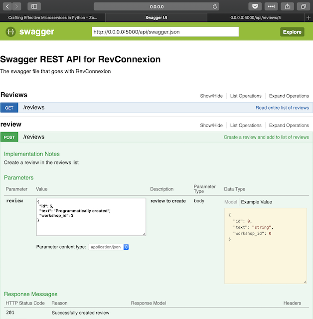

# RevConnexion

## Project Description
This project is an implementation of [Connexion](connexion.readthedocs.io/en/latest/) on top of Flask. It demonstrates the OpenAPI and Swagger functionalities courtesy of connexion using a simple workshop reviews case example (context).

### About Connexion
Swagger/OpenAPI First framework for Python on top of Flask with automatic endpoint validation & OAuth2 support. Connexion is a framework that automagically handles HTTP requests based on OpenAPI Specification (formerly known as Swagger Spec) of your API described in YAML format

## Getting Started

### Prerequisites
Python 3.6, Connexion and Flask

> Python 3.6 is required because of the f-strings (formatted string literals, PEP 498). The more widespread `.format()` can be used as the drop-in replacement, in which case Python 3.4+ will be fully compatible.  

### Setting up: Installation of Packages
#### Method 1: Install from `requirements.txt`
Activate your virtual environment, then:
```
pip install -r requirements.txt
```

#### Method 2: Manual Installation
Manually install Flask and Connexion:
```
pip install flask
pip install connexion
```

### Running the app
Starting the app is as simple as:
```
python3 app.py
```

Navigate to http://0.0.0.0:5000/api/ui and you'll be greeted with the Swagger UI screen:


### Using the app
- A `GET` HTTP method on `/reviews` is implemented, as shown in the Swagger UI. Clicking on `Try it out!` will show the CURL as well as the Request URL methods. In your terminal, copy and paste the curl command:
```
curl -X GET --header 'Accept: application/json' 'http://0.0.0.0:5000/api/reviews'

# returns:
[
  {
    "reviews": "Incredible teaching!",
    "timestamp": "2019-05-03 17:07:58",
    "workshop_id": 1
  },
  {
    "reviews": "Entertaining.",
    "timestamp": "2019-05-03 17:07:58",
    "workshop_id": 2
  },
  {
    "reviews": "Learning is fun.",
    "timestamp": "2019-05-03 17:07:58",
    "workshop_id": 3
  }
]
```

- Navigate to the Request URL for either `/reviews` or `/reviews/{id}`. For example, the  url http://0.0.0.0:5000/api/reviews/2 will return:
```
{
  "reviews": "Entertaining.",
  "timestamp": "2019-05-03 20:04:54",
  "workshop_id": 2
}
```

- Try the `POST` method for `/reviews`. For example, paste the following code and submit it then navigate to http://0.0.0.0:5000/api/reviews/6 to see your review!
```
{
  "id": 6,
  "text": "So. Much. Love.",
  "workshop_id": 3
}
```

- Notice that entering a review with an `id` value that already exist will return a 406 error (implemented in `reviews.py`) and an invalid JSON (try missing out the comma, or any schema error) will raise a failed validation error and abort.

## Learning References
1. Learn by tweaking things and see the changes. Start renaming the `operationId` in `swagger.yml` and then the corresponding function name. Next, look into the `GET` parameters and change the query from a path-based one to a query-based (or vice-versa). Refer to the [official documentation](https://swagger.io/docs/specification/describing-parameters/) for the parameters.

2. Doug Farrell's [article on Real Python](https://realpython.com/flask-connexion-rest-api/) is a great tutorial.

3. Meet up! Stay in touch with [me](https://www.facebook.com/onlyphantom)  or [my team at Algoritma](https://algorit.ma) and look out for upcoming events - join us in our community meetups or workshops where we discuss all things Python and R.